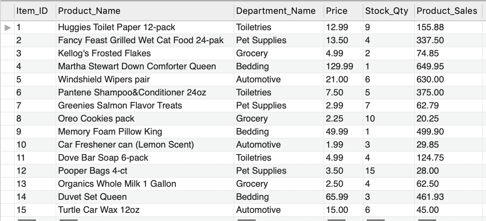
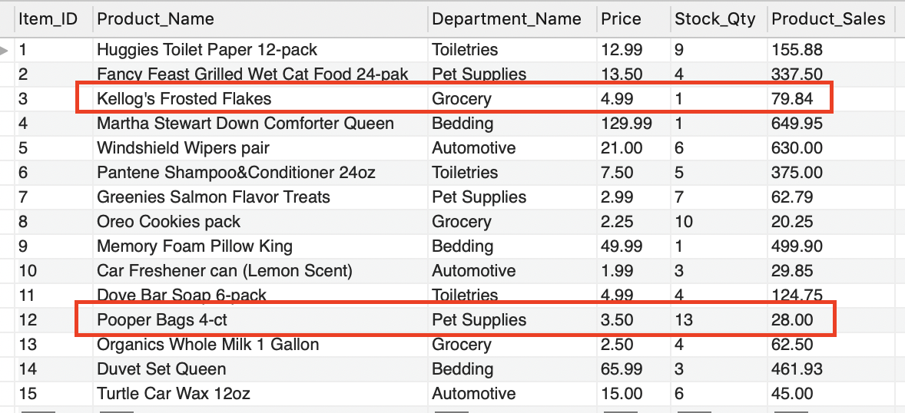
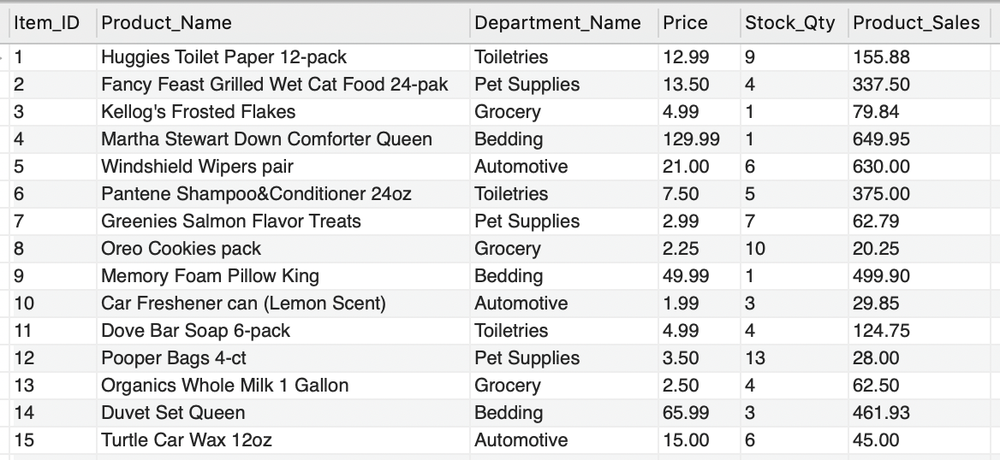
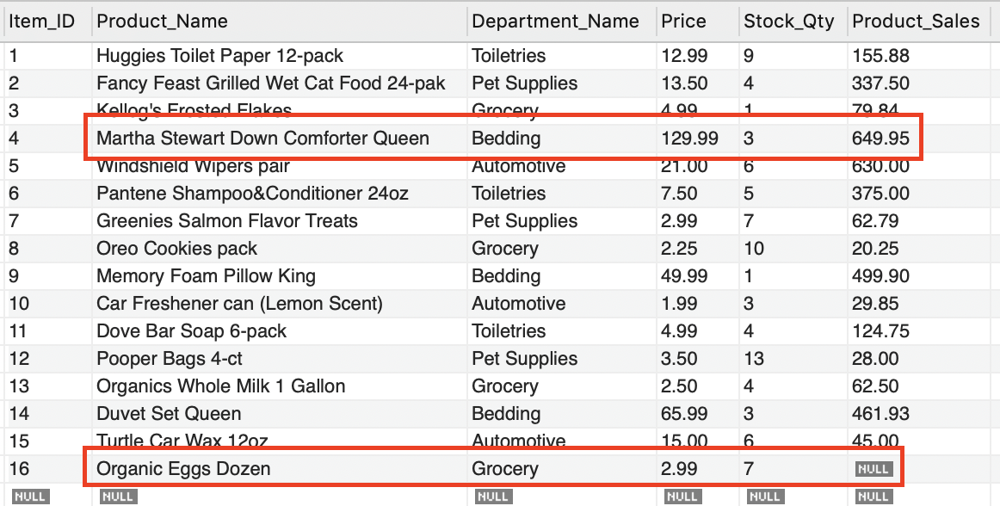
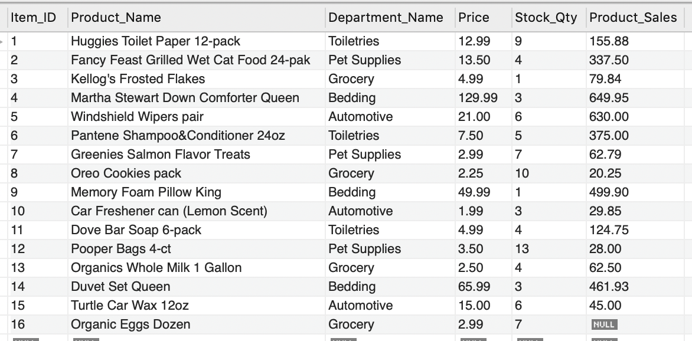
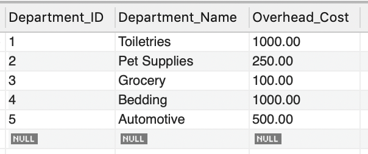
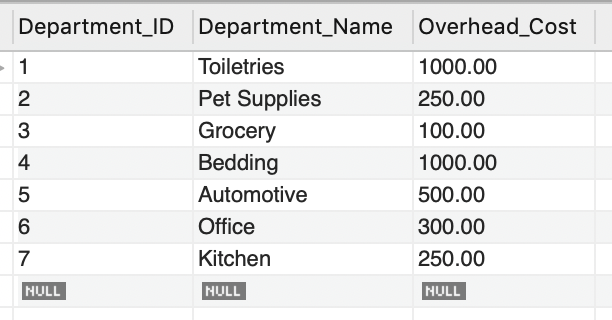

# BAmazon
An Amazon-like storefront that uses the MySQL and Node.js

## Overview

The app will take in orders from customers and deplete stock from the store's inventory. There is also a Manager mode in which the app can update/add products and inventory. As a bonus task, the app can also track product sales across store's departments and then provide a summary of the highest-grossing departments in the store.

## Design Concept

### Customer View

1. A MySQL Database called `bamazon` was initially created.

2. Then a Table is created inside of that database called `products`.

3. The products table have each of the following columns:

* item_id (unique id for each product)

* product_name (Name of product)

* department_name

* price (cost to customer)

* stock_quantity (how much of the product is available in stores)

* product_sales (the price of the product multiplied by the quantity purchased will be added to this column)

4. This database is then populated with around 10 different products. ("mock" data rows added into this database and table).

5. A Node application called `bamazonCustomer.js` has been created. Running this application will first display all of the items available for sale which include the ids, names, and prices of products for sale.

6. The app will then prompt users with two messages.

* The first will ask them the ID of the product they would like to buy.
* The second message will ask how many units of the product they would like to buy.

7. Once the customer has placed the order, the application will check if your store has enough of the product to meet the customer's request.

* If not, the app will log a phrase like `Insufficient quantity!`, and then prevent the order from going through.

8. However, if the store _does_ have enough of the product, it will fulfill the customer's order.
* This means the SQL database will be updated to reflect the remaining quantity.
* Once the update goes through, the customer will be shown the total cost of their purchase.

<a href="https://drive.google.com/file/d/1gxpM3oqrZDnCVogsifTy418LE7A23S_V/view" target="blank">Click for DEMO</a>
  

 

  

### Manager View (Next Level)

* A Node application called `bamazonManager.js` is created separately for this. Running this application will:

* List a set of menu options:

* View Products for Sale

* View Low Inventory

* Add to Inventory

* Add New Product

* If a manager selects `View Products for Sale`, the app will list every available item: the item IDs, names, prices, and quantities.

* If a manager selects `View Low Inventory`, then it will list all items with an inventory count lower than five.

* If a manager selects `Add to Inventory`, it will display a prompt that will let the manager "add more" of any item currently in the store.

* If a manager selects `Add New Product`, it will allow the manager to add a completely new product to the store.

<a href="https://drive.google.com/file/d/1EmglbBOJSPc0NY6Q22sfkv1m0jc02FF5/view" target="blank">Click for DEMO</a>
  

 

  

### Supervisor View (Final Level)

1. Another new MySQL table called `departments` is created for this. The table will include the following columns:

* department_id

* department_name

* over_head_costs (A dummy number set for each department)

2. Another Node app called `bamazonSupervisor.js` is created for this. Running this application will list a set of menu options:

* View Product Sales by Department

* Create New Department

4. When a supervisor selects `View Product Sales by Department`, the app will display a summarized table in their terminal/bash window. The table below serves as an example.

| department_id | department_name | over_head_costs | product_sales | total_profit |
| ------------- | --------------- | --------------- | ------------- | ------------ |
| 01            | Electronics     | 10000           | 20000         | 10000        |
| 02            | Clothing        | 60000           | 100000        | 40000        |

5. The `product_sales` column will be calculated on the fly using the sum of `product_sales` of all products belonging to the same department in the products table and is not stored in any database. 

6. The `total_profit` column will be calculated on the fly using the difference between `over_head_costs` and `product_sales`. `total_profit` is not stored in any database. 

<a href="https://drive.google.com/file/d/1gfSJfEv6GeBnYTvv5bGWwmArqOrgIS6A/view" target="blank">Click for DEMO</a>
  

 

 

 
